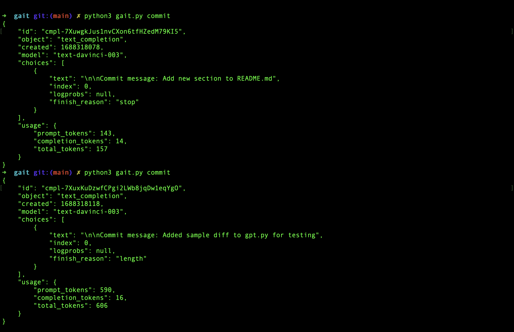
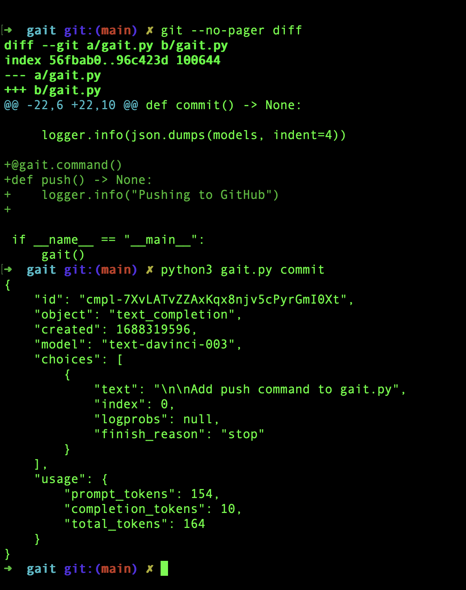
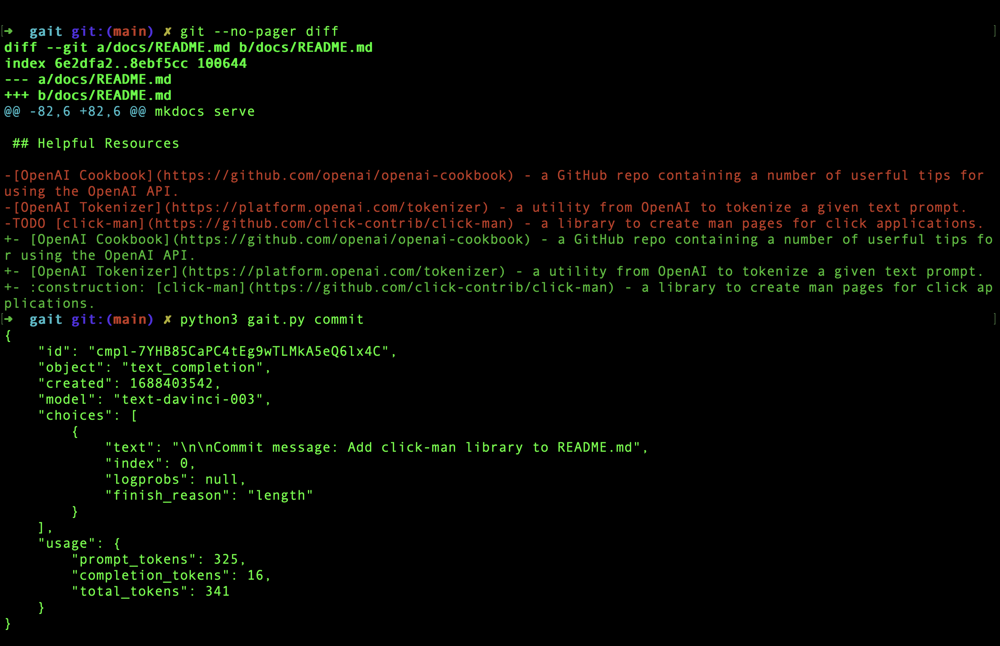
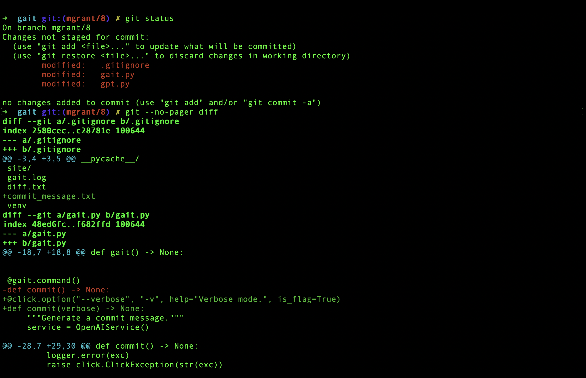
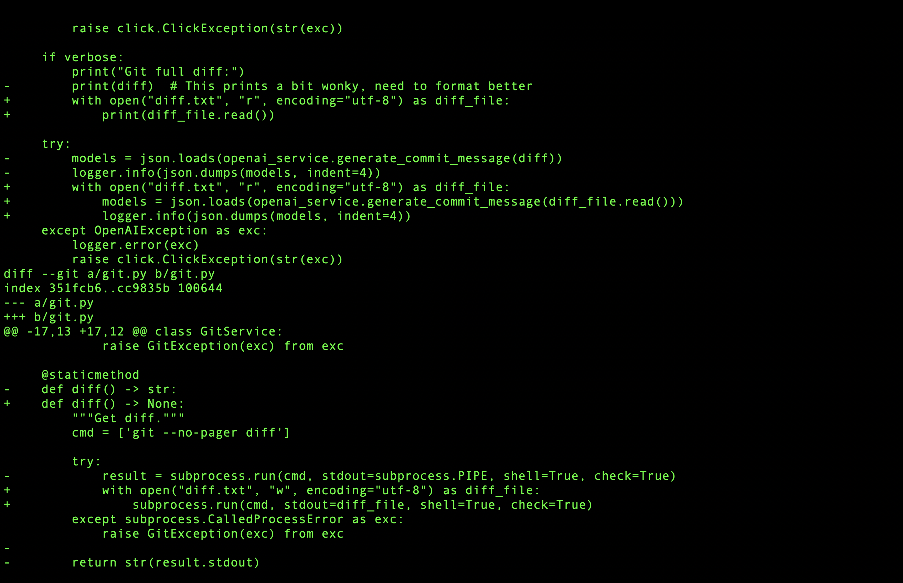

# Tests

This page is a dumping ground for any tests that you run and their results.  Please try to include as much configuration context as possible to ensure consistency across test runs.

## Test Run 1

*Comparing sample diff to real git diff in working directory.*

## Test Run 2

*Another example of a real git diff and the commit message written by ChatGPT.*

## Test Run 3

*Subtle changes are not well-recognized.  Need to tweak the propmpt or train the model somehow.*

## Test Run 5

*Demo run through of the flow for [#8](https://github.com/mgzwarrior/gait/issues/8)*