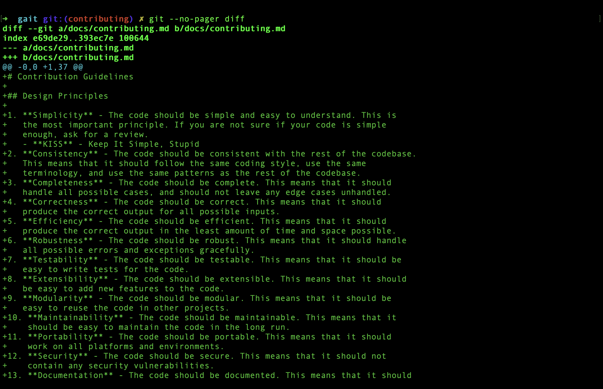
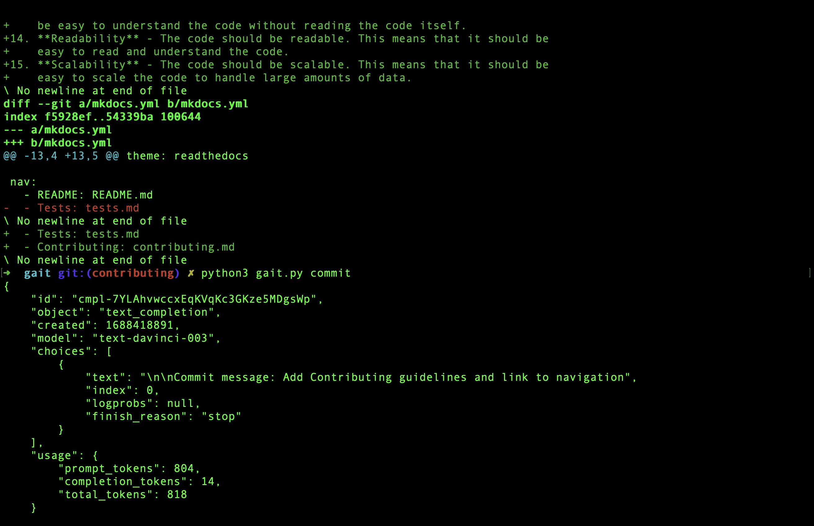
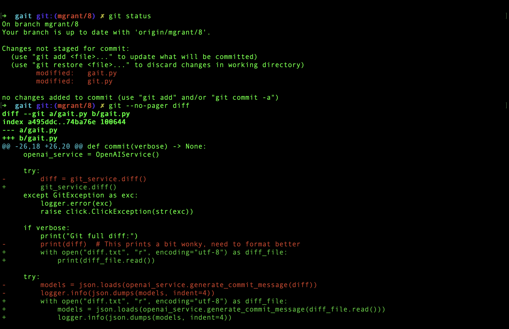
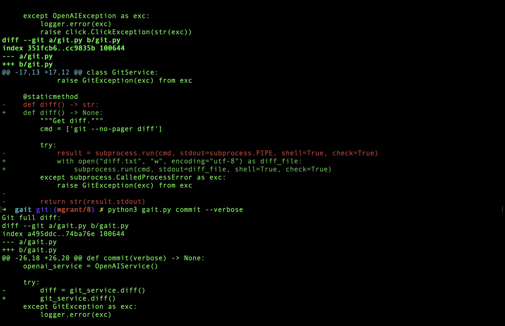
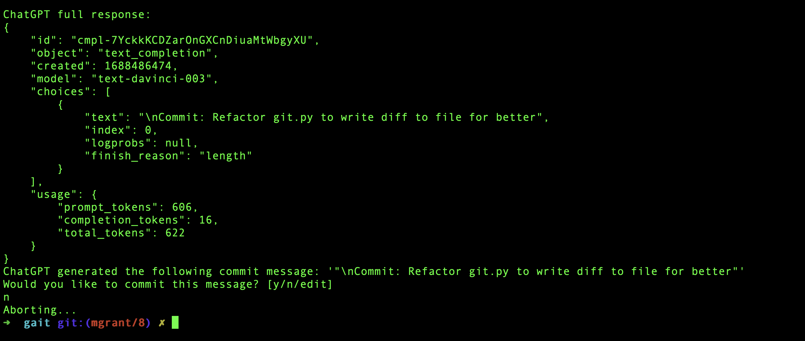
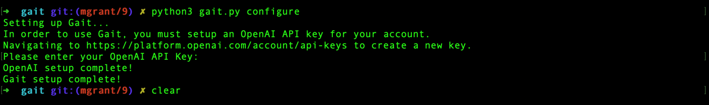

# Tests

This page is a dumping ground for any tests that you run and their results.  Please try to include as much configuration context as possible to ensure consistency across test runs.

## Test Run 1

*Comparing sample diff to real git diff in working directory.*

## Test Run 2

*Another example of a real git diff and the commit message written by ChatGPT.*

## Test Run 3

*Subtle changes are not well-recognized.  Need to tweak the propmpt or train the model somehow.*

## Test Run 4

*New files and additions to existing files are well handled.*

## Test Run 5

*Note that formatting of the diff is correct, but consider adding syntax highlighting for clarity.*

*Note that the commit message is correct, but the finish_reason is length even though we are no where close to the token limit.  Need to research this further.*
*Demo run through of the flow for [#8](https://github.com/mgzwarrior/gait/issues/8)*

## Test Run 6

*Demo run through of the flow for [#9](https://github.com/mgzwarrior/gait/issues/9)*
